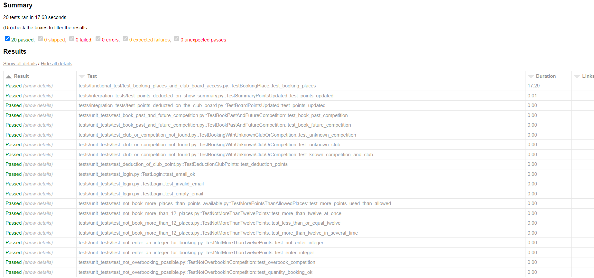
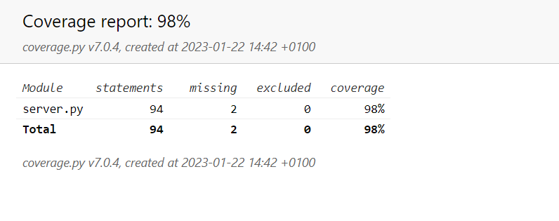
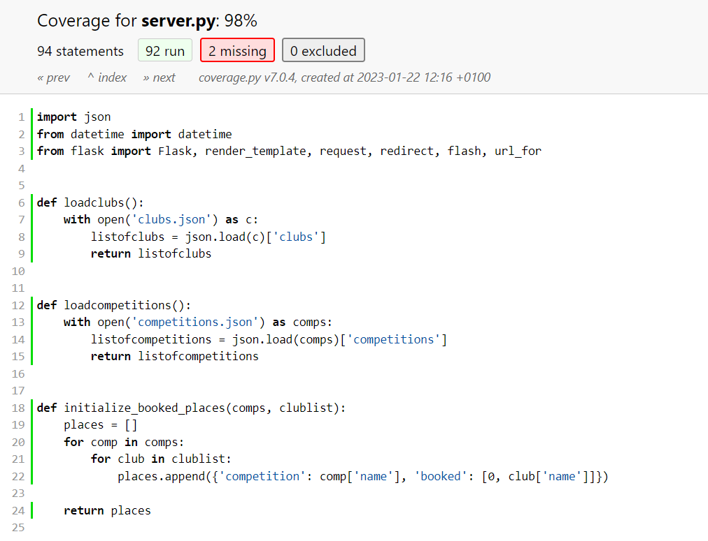
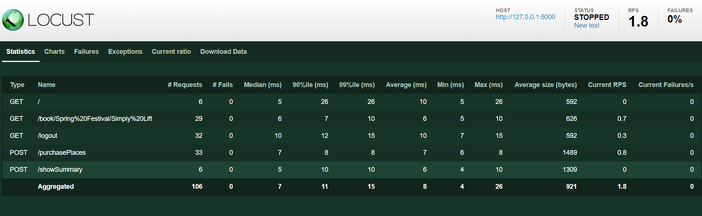
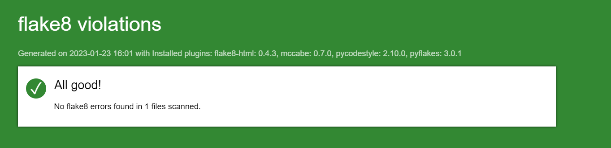

# Projet 11 DA-Python OC
***Livrable forké et cloné à partir du repository [Python_Testing](https://github.com/OpenClassrooms-Student-Center/Python_Testing) d'OpenClassrooms-Student-Center.***  
Il s'agit d'une plateforme de réservation de places à des compétitions de force pour l'entreprise Güdlft.  
L'objectif du projet est de corriger les bugs et d'implémenter une nouvelle fonctionnalité décrits dans l'Issue repository du projet originel.  
Chaque correctif de bug ou fonctionnalité correspond à une branche. Il y a égélement une branche d'affinement des tests et une branche QA stable.
Les tests peuvent être éxécutés via Pytest et Locust.  
## Sommaire

**[1. Installation et lancement](#heading--1)**
  * [1.1. Windows](#heading--1-1)
  * [1.2. MacOS et Linux](#heading--1-2)

**[2. Tests](#heading--2)**
  * [2.1 Lancement des tests](#heading--2-1)
  * [2.2 Présentation des rapports](#heading--2-2)

       

### 1. Installation et lancement

#### 1.1 Windows :
   Depuis votre terminal, naviguez vers le dossier racine souhaité.

###### Récupération du projet
   Tapez :    

       git clone https://github.com/Cyl94700/P11_Op_Cl.git

###### Accès au dossier du projet, création et activation l'environnement virtuel
   Tapez :

       cd P11_Op_Cl
       python -m venv env 
       env\scripts\activate
    
###### Installation des paquets requis
   Tapez :

       pip install -r requirements.txt

###### Lancement du serveur Flask
   Tapez :

      $env:FLASK_APP = "server.py"
      flask run

Puis, accédez à l'adresse par défaut : [http://127.0.0.1:5000/](http://127.0.0.1:5000/)

---------

####  1.2 MacOS et Linux :
   Depuis votre terminal, naviguez vers le dossier souhaité.

###### Récupération du projet
   Tapez :

       git clone https://github.com/Cyl94700/P11_Op_Cl.git

###### Accéder au dossier du projet, créer et activer l'environnement virtuel
   Tapez :

       cd P11_Op_Cl
       python3 -m venv env 
       source env/bin/activate
    
###### Installation des paquets requis
   Tapez :

       pip install -r requirements.txt

###### Lancement du serveur Flask
   Tapez :

       export FLASK_APP=server
       flask run

Puis, accédez à l'adresse par défaut : [http://127.0.0.1:5000/](http://127.0.0.1:5000/)

### 2. Tests

#### 2.1 Lancement des tests

###### Tests unitaires, d'intégration, fonctionnel et de couverture  
Ces tests peuvent être effectués ensemble grâce à Pytest et Coverage. Pour que le test fonctionnel passe, il faut avoir lancé le serveur Flask au préalable.  
Supprimez le dossier htmlcov et le fichier report.html présents en racine du projet.
Exécutez ensuite la commande :

    pytest --html=report.html --cov-report html:cov_html  
- Un fichier report.html est alors regénéré. Il suffit de l'ouvrir avec votre navigateur et vous pouvez consulter le rapport des tests unitaires, d'intégration et fonctionnel.  
- Un répertoire htmlcov est égélement présent. En l'ouvrant, vous pouvez consulter le rapport des tests de couverture à partir du fichier index.html

###### Lancement des tests de performances Locust  
Assurez-vous d'avoir lancé le serveur Flask, puis tapez :
 
    locust -f .\tests\performance_tests\locustfile.py --web-host=localhost  

Vous êtes alors invité à vous rendre sur l'adresse [http://localhost:8089](http://localhost:8089). Entrez les options souhaitées, comme 6 pour le nombre d'utilisateurs simultanés et pour 'host' l'adresse du site (http://127.0.0.1:5000/).  
Cliquez sur le bouton Start Swarming pour démarrer le test.

###### Flake8
Pour vérifier la cohérence du code avec la norme PEP8, vous pouvez lancer flake8-html et générer un rapport html.
Supprimez le dossier flake8_report situé à la racine du projet.
Depuis le terminal, placez-vous à la racine du projet et tapez :
 

      flake8 --format=html --htmldir=flake8_report

Le dossier flake8_report est de nouveau généré. Il contient le rapport global dans un fichier nommé index.html

#### 2.2 Présentation des rapports

###### Tests  

  

  

  

###### Performance  

  

###### Flake8  

 
